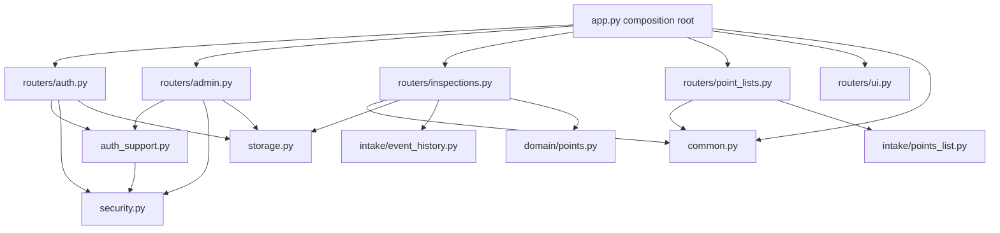

# Data Structures and Dependencies

## Primary Data Structures (Storage Models)
Defined in `src/alarm_inspection/storage.py`.

- `Inspection`
- `User`
- `UserSession`
- `AppSetting`
- `PointList`
- `SourceFile`
- `PointListDecision`
- `PointListEventDate`

These models are the persistence contract and should be treated as stable unless a migration plan is included.

## API Module Dependency Map

## Feature Ownership
- `routers/auth.py`: login/session/profile/reset-password endpoints.
- `routers/admin.py`: user and default-password admin operations.
- `routers/inspections.py`: inspection CRUD, event-history upload, event-date save/clear.
- `routers/point_lists.py`: points-list preview parser endpoint.
- `routers/ui.py`: homepage and review script delivery.

## Shared Helper Ownership
- `security.py`: password hashing and verification primitives.
- `auth_support.py`: auth/admin helper operations using persisted settings and sessions.
- `common.py`: upload path, coercion, date/time parsing, and event kind helpers.

## Invariants
1. Approved point decisions are never silently replaced.
2. Event-date mappings are additive unless explicitly cleared.
3. Mapping accepts only allowed accepted points for the selected points list.
4. Review completion requires all rows accepted or deleted.
